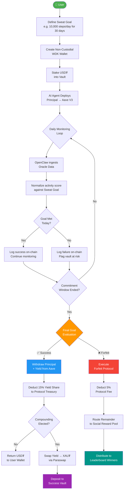
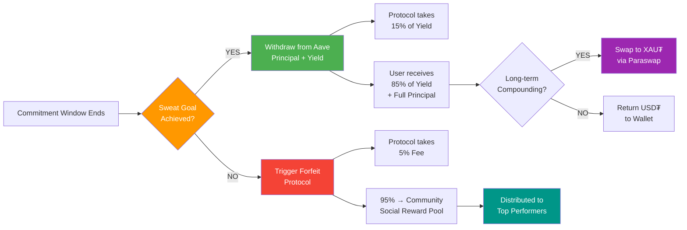
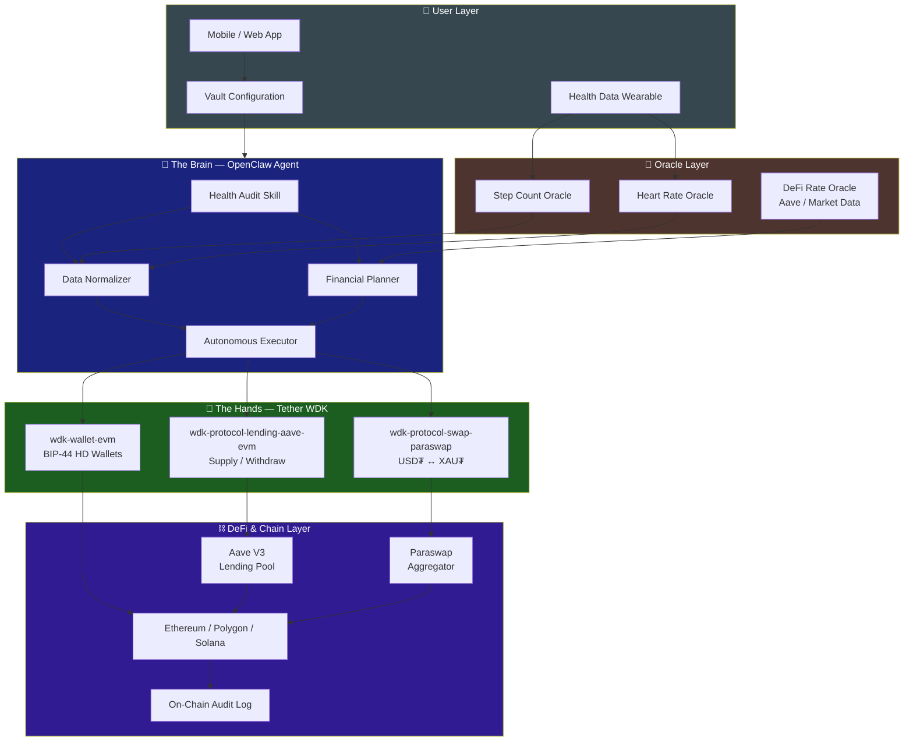
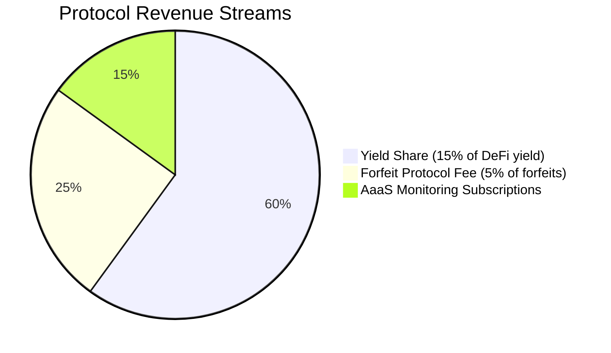
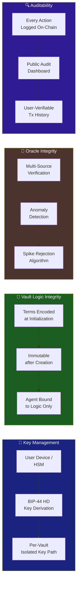
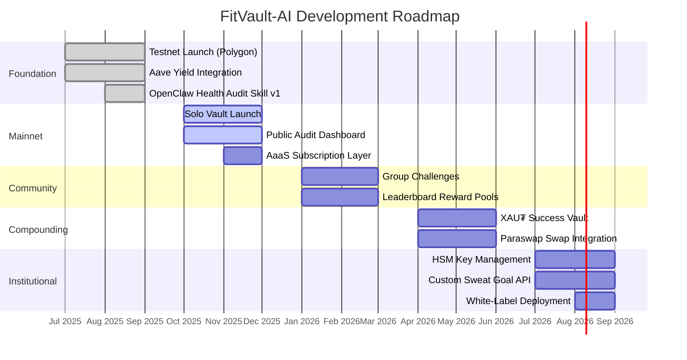

# FitVault-AI

**Autonomous Health Commitment Infrastructure — Powered by Tether**

[](https://opensource.org/licenses/MIT)
[](https://tether.io)
[](https://openclaw.io)
[](https://polygon.technology)
[](https://github.com/your-team/fitvault-ai-agent)

---

## What Is FitVault-AI?

FitVault-AI is an agentic financial infrastructure that converts personal discipline into a programmable, yield-bearing commitment. Users lock stablecoins into a self-custodial vault against a defined fitness goal. An autonomous AI agent then manages that stake on their behalf — deploying it into DeFi yield protocols while monitoring their activity in real time.

Succeed, and you reclaim your principal plus everything it earned. Miss your goal, and the forfeit flows to a community reward pool. There are no governance tokens, no inflationary rewards, and no reliance on a constant stream of new participants. The only variable is whether you showed up.

```
┌─────────────────────────────────────────────────────────────────┐
│                                                                 │
│   USER STAKES USD₮  ──▶  AI DEPLOYS TO AAVE  ──▶  YIELD GROWS │
│                                                                 │
│   GOAL MET?   YES ──▶  Principal + 85% Yield  ──▶  USER        │
│               NO  ──▶  Forfeit to Community Pool + Protocol Fee │
│                                                                 │
└─────────────────────────────────────────────────────────────────┘
```

---

## The Problem with Move-to-Earn

The first generation of Move-to-Earn (M2E) protocols — StepN, Sweatcoin, and their successors — shared an elegant premise and a fatal design flaw. They rewarded physical activity with project-native tokens, which created an immediate supply-demand imbalance: tokens were minted continuously while demand depended entirely on new users buying in to participate. The moment growth stalled, token value collapsed, and with it the incentive to move at all.

This is not a failure of execution. It is a structural inevitability. Any system that pays rewards by printing its own currency is implicitly a Ponzi — sustainable only as long as the next cohort of participants subsidizes the last.

```
Legacy M2E Death Spiral
───────────────────────

  New Users Join
       │
       ▼
  Tokens Minted as Rewards
       │
       ▼
  Early Users Sell Tokens ──────────────────────┐
       │                                         │
       ▼                                         ▼
  Token Price Falls                      Incentive to Join
       │                                  Falls Further
       ▼
  Fewer New Users ◀────────────────────────────┘
       │
       ▼
  Protocol Collapses
```

FitVault-AI is built on an entirely different premise. It does not print anything. It does not require growth to sustain itself. It generates value by putting existing capital to work in established DeFi protocols and sharing that yield with the users whose discipline made it possible.

---

## The Solution: Commitment-as-a-Service

Rather than rewarding activity with newly minted tokens, FitVault-AI inverts the model. Users stake assets they already own — real, stable-value assets — against a commitment they make to themselves. The protocol's job is to hold them accountable and ensure that commitment is enforced faithfully and transparently, without any centralized party having discretion over the outcome.

This reframes the product entirely. FitVault-AI is not a fitness app with a token. It is a **personal financial accountability layer** with fitness as the condition.

The result is a system with aligned incentives at every level: users are motivated to perform because they have real money on the line; the protocol earns revenue from yield and forfeit fees rather than token sales; and the community reward pool grows from genuine economic activity, not inflation.

---

## Core Mechanics

### Full Vault Lifecycle



### Vault Initialization

When a user creates a vault, they define three things: the asset they wish to stake (USD₮ by default), the amount, and the Sweat Goal — a measurable fitness target such as a daily step count, active minutes, or heart-rate threshold sustained over a defined period. These terms are encoded into the vault's logic at creation and cannot be altered retroactively. The agent is bound to them absolutely.

### Stake Deployment

Upon staking, the committed USD₮ is not held idle. The AI agent immediately deploys the full principal into Aave V3 via the Tether WDK lending protocol integration, where it begins accruing yield. The user's money is working from the moment the vault is initialized.

### Continuous Monitoring

The OpenClaw Health Audit Agent monitors the user's activity data continuously, ingesting inputs from step-count and heart-rate oracles and normalizing them against the vault's defined success criteria. It also tracks live DeFi market conditions, adjusting rebalancing decisions based on current USD₮ lending rates across protocols. The agent operates without polling the user for confirmation — it executes the logic it was given.

### Settlement Decision Tree



---

## System Architecture

FitVault-AI enforces a strict separation between reasoning and execution. This design ensures that the AI agent can be upgraded or swapped independently of the financial execution layer, and that the financial layer cannot be manipulated through the AI layer.



### The Brain — OpenClaw Agent

OpenClaw provides the reasoning infrastructure. FitVault-AI runs a custom Health Audit Skill on top of it, responsible for three distinct functions:

**Data normalization** ingests raw oracle feeds — step counts, heart-rate measurements, GPS traces — and converts them into a standardized activity score that can be evaluated deterministically against vault conditions. This abstraction layer means the vault logic remains stable even as the underlying data sources change.

**Financial planning** evaluates current lending rates across integrated DeFi protocols and determines optimal deployment strategies for the staked principal. When rates shift significantly, the agent can rebalance between protocols to maximize yield within the risk parameters set at vault creation.

**Autonomous execution** is the most critical function. Once vault terms are set, the agent operates in fully autonomous mode. It does not wait for user approval to execute a penalty. It does not send notifications asking for confirmation. The pre-defined economic logic is the contract, and the agent enforces it with the same consistency it would apply at the first execution or the ten-thousandth.

### The Hands — Tether WDK

The Tether Wallet Development Kit provides the secure, non-custodial financial execution layer that allows the agent to act as a genuine financial entity without ever taking custody of user funds.

The WDK handles wallet generation using BIP-44 HD wallet standards, ensuring that each vault is isolated in its own deterministic key path. Multi-chain support across Ethereum, Polygon, and Solana is registered at initialization, giving the protocol flexibility to route transactions based on gas costs and protocol availability.

Protocol integrations are registered modularly. The lending integration connects the agent to Aave V3, enabling the supply and withdrawal operations that power the yield layer. The swap integration connects to Paraswap, enabling the USD₮-to-XAU₮ conversion used in the Success Vault compounding path. Additional protocol integrations — such as alternative lending markets or cross-chain bridges — can be registered without modifying the core agent logic.

---

## Supported Assets

| Asset | Role | Network |
|---|---|---|
| **USD₮** (Tether USD) | Primary stake and settlement currency | Ethereum, Polygon, Solana |
| **XAU₮** (Tether Gold) | Long-term reward compounding target | Ethereum |

USD₮ was chosen for its unmatched liquidity and deep integration with DeFi lending markets. XAU₮ provides users who want long-term wealth preservation a non-inflationary alternative to holding cash-equivalent rewards.

---

## Business Model

FitVault-AI generates revenue from economic activity within the protocol, not from token issuance or venture subsidy. This creates a direct alignment between protocol health and user activity — the more users stake and the more yield the agent generates, the more sustainable the protocol becomes.



**Yield sharing** is the primary revenue stream. The agent retains 15% of all DeFi yield generated on staked assets. The remaining 85% flows back to the user on successful completion. This fee is only charged when the user succeeds — the protocol profits when users win.

**Forfeit fees** account for a 5% management charge on forfeited stakes before they enter the community reward pool. This fee is intentionally modest to ensure that community distributions remain meaningful.

**Agent-as-a-Service (AaaS) subscriptions** provide a recurring revenue layer through micro-fees in USD₮ charged for high-frequency health monitoring. Users who require more granular tracking windows — for example, hourly heart-rate compliance checks rather than daily summaries — pay a small subscription fee for the additional compute.

### How Value Flows Through the Protocol

```
  100 USD₮ Staked
       │
       ├──▶ Deployed to Aave V3
       │         │
       │         └──▶ Earns ~4% APY over 30 days ≈ 0.33 USD₮ yield
       │
  ─────────────────────────────────────────
  IF GOAL MET:
       │
       ├──▶ 0.28 USD₮ (85% yield)  ──▶  User receives 100.28 USD₮
       └──▶ 0.05 USD₮ (15% yield)  ──▶  Protocol Treasury
  ─────────────────────────────────────────
  IF GOAL MISSED:
       │
       ├──▶  5.00 USD₮ (5% fee)    ──▶  Protocol Treasury
       └──▶ 95.00 USD₮ (95%)       ──▶  Community Reward Pool
```

---

## Comparison

| | Legacy Move-to-Earn | FitVault-AI |
|---|---|---|
| **Reward Asset** | Volatile, project-native tokens | USD₮ principal + DeFi yield |
| **Value Source** | New user inflows (inflationary) | Yield on real staked capital |
| **Sustainability** | Dependent on perpetual growth | Self-sustaining via yield economics |
| **Agent Role** | Passive step tracker | Active financial fiduciary |
| **User Risk** | Token depreciation to zero | Forfeiting your own stake |
| **Transparency** | Off-chain, opaque scoring | Fully on-chain, auditable |
| **Custody** | Custodial (platform holds funds) | Self-custodial throughout |

---

## Security & Trust Model



**Self-custody throughout.** FitVault-AI never takes custody of user funds and never stores or transmits private keys. All key material is managed locally via the WDK's encrypted storage or, for institutional users, via Hardware Security Module (HSM) integration. The protocol's smart contracts and the AI agent have only the permissions required to execute the pre-authorized vault logic — nothing more.

**Immutable vault terms.** The economic logic encoded at vault creation cannot be altered by the user, the agent, or the protocol team after initialization. This eliminates the possibility of retroactive rule changes and ensures users know exactly what they agreed to.

**On-chain auditability.** Every autonomous agent action — DeFi supply, withdrawal, swap, forfeit execution, reward distribution — is logged on-chain and surfaced in a public audit dashboard. Users can verify every transaction taken on their behalf at any time.

**Oracle integrity.** Health data oracles are verified against multiple independent sources before being accepted as valid inputs. The agent is designed to reject anomalous data spikes that could be used to game vault conditions, such as a sudden implausible jump in step count at the end of a commitment window.

---

## Roadmap



---

## Getting Started

Full setup documentation is available in the `/docs` directory. At a minimum, you will need Node.js 18+, a configured Tether WDK environment, and access to a health data oracle endpoint.

Refer to `docs/quickstart.md` for a step-by-step walkthrough of initializing your first vault on testnet, and `docs/agent-configuration.md` for a complete reference on Sweat Goal parameters and agent logic settings.

```
docs/
├── quickstart.md              # First vault on testnet
├── agent-configuration.md     # Sweat Goal & agent logic reference
├── wdk-integration.md         # Tether WDK setup & wallet management
├── oracle-setup.md            # Health data oracle configuration
├── security.md                # Key management & HSM guide
└── architecture.md            # Deep-dive system design
```

---

## Contributing

Contributions are welcome. Please read `CONTRIBUTING.md` before opening a pull request. All submissions must include tests and adhere to the existing code style. Security-relevant issues should be reported privately via the disclosure process described in `SECURITY.md`.

---

## License

MIT License. See `LICENSE` for details.

---

> **Disclaimer:** FitVault-AI is currently in pre-production. All protocol logic, fee structures, and integration details are subject to change before mainnet deployment. Independent smart contract audits will be published prior to any production launch.

---

*FitVault-AI — Powered by Tether. Driven by Sweat.*
